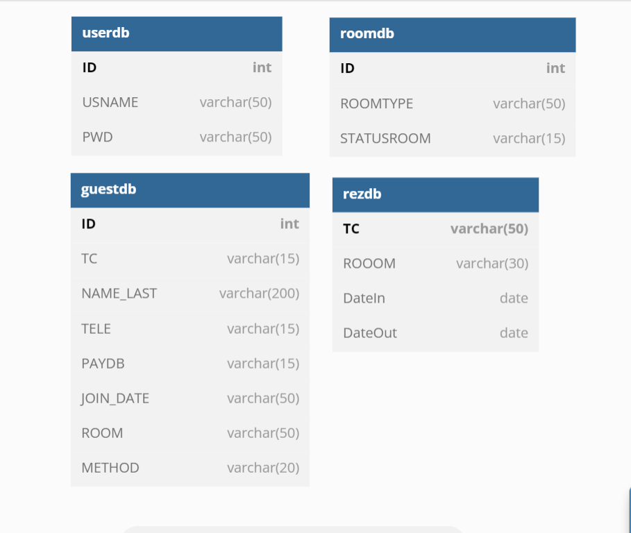

# Otel Yönetim Sistemi

## Açıklama
>Otel resepsiyonistinin ziyaretçi hakkında bilgi almasına ve onun için oda rezervasyonu yapmasına ve ayrıca otel sahibine fayda sağlayan hizmetler sağlayan bir uygulama

## Kullanım Amacı
>Bu uygulamanın amaçlarından biri de ziyaretçiler için veri tabanları düzenleyerek kağıt kalem yazmaktan vazgeçerek paranın içini ve dışını hesaplamak ve resepsiyon görevlisinin işini kolaylaştırmaktır.
Uygulama ziyaretçi bilgilerinin alınması ve bir veri tabanına kaydedilmesi esasına dayanmaktadır.Ayrıca oteldeki müsait odalar için bir sayfa bulunmaktadır.Ziyaretçi bilgileri hazırlanıp kaydedildikten ve müsait odalar müsait olduktan sonra rezervasyon sayfasına girilir. , ve ardından bu ziyaretçi adına odalar rezerve edilir.Ayrıca, otelin ne kadar girdiğini ve odaların ne kadar girdiğini bildiğiniz bir gösterge tablosu mevcuttur.
Ve ayrıca uygulamamızda keşfetmeniz için çok ama çok daha fazlası sizi bekliyor.

## Database Scheme

## MOHAMMAD RAMEZ MOHAMMAD 212523502
